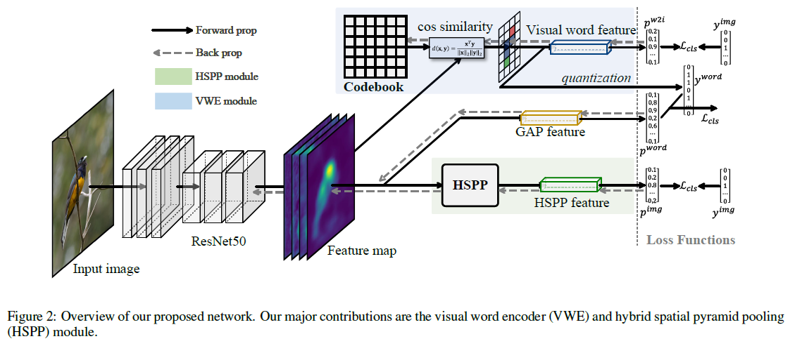
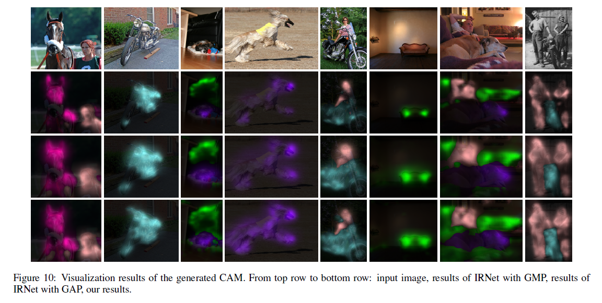

# [IJCAI 2021] Learning Visual Words for Weakly-Supervised Semantic Segmentation

Implementation of IJCAI 2021 paper [Learning Visual Words for Weakly-Supervised Semantic Segmentation](https://lixiangru.cn/assets/files/vwe.pdf), a work on generating better CAM for Weakly-Supervised Semantic Segmentation.

## Abstract
> Current weakly-supervised semantic segmentation (WSSS) methods with image-level labels mainly adopt class activation maps (CAM) to generate the initial pseudo labels. However, CAM usually only identifies the most discriminative object extents, which is attributed to the fact that the network doesn't need to discover the integral object to recognize image-level labels. In this work, to tackle this problem, we proposed to simultaneously learn the image-level labels and local visual word labels. Specifically, in each forward propagation, the feature maps of the input image will be encoded to visual words with a learnable codebook. By enforcing the network to classify the encoded fine-grained visual words, the generated CAM could cover more semantic regions. Besides, we also proposed a hybrid spatial pyramid pooling module that could preserve local maximum and global average values of feature maps, so that more object details and less background were considered. Based on the proposed methods, we conducted experiments on the PASCAL VOC 2012 dataset. Our proposed method achieved 67.2% mIoU on the val set and 67.3% mIoU on the test set, which outperformed recent state-of-the-art methods.



## Start

### Create and activate conda environment
``` bash
conda create --name py36 python=3.6
conda activate py36
pip install -r requirments.txt
```

### Clone this repo
``` bash
git clone https://github.com/rulixiang/vwe.git
cd vwe
```
### train & infer & evaluate  

``` bash
# train network
python train_cam.py --gpu 0,1 --configs/voc.yaml
# infer cam
python infer_cam.py --gpu 0,1 --configs/voc.yaml
# evaluate cam
python eval_cam.py
```


### Comparasion of the generated CAM


### Evaulation on the PASCAL VOC 2012 Dataset


|      |  bkg | aero | bike | bird | boat | bottle |  bus |  car |  cat | chair |  cow | table |  dog | horse | motor | person | plant | sheep | sofa | train |  tv  | mIOU |
|------|:----:|:----:|:----:|:----:|:----:|:------:|:----:|:----:|:----:|:-----:|:----:|:-----:|:----:|:-----:|:-----:|:------:|:-----:|:-----:|:----:|:-----:|:----:|:----:|
| val  | 89.2 | 75.7 | 31.1 | 82.4 | 66.1 |  61.7  | 87.5 | 77.8 | 82.8 |  32.2 | 81.4 |  34.1 | 77.4 |  77.6 |  76.7 |  75.0  |  51.2 |  78.1 | 42.4 |  71.4 | 59.6 | 67.2 |
| test | 90.3 | 76.9 | 31.6 | 89.1 | 54.8 |  57.8  | 86.4 | 77.8 | 81.8 |  32.2 | 76.0 |  39.3 | 80.3 |  80.3 |  81.8 |  74.3  |  44.5 |  80.1 | 54.5 |  63.0 | 60.4 | 67.3 |

## Citation
```
@inproceedings{
  ru2021learning,
  title={Learning Visual Words for Weakly-Supervised Semantic Segmentation},
  author={Lixiang Ru and Bo Du and Chen Wu},
  booktitle={International Joint Conference on Artificial Intelligence},
  year={2021},
}
```

## Acknowledgement
This repo is heavily borrowed from [IRNet](https://github.com/jiwoon-ahn/irn). Thanks for their brilliant work!
