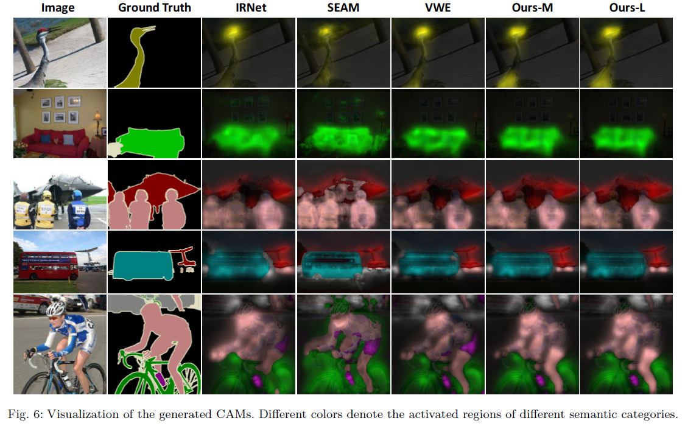

# Weakly-Supervised Semantic Segmentation with Visual WordsLearning and Hybrid Pooling

Implementation of [Weakly-Supervised Semantic Segmentation with Visual Words Learning and Hybrid Pooling]() [Under Review], an improved version of our [IJCAI 2021 work]().

## What's New?
Compared with the conference version, this work further
- improves the learning-based strategy;
- proposes the memory-bank strategy;
- includes further experiments on more datasets;
- remarkably surpasses the latest state-of-the-art methods. 



## Start

### Create and activate conda environment
``` bash
conda create --name py36 python=3.6
conda activate py36
pip install -r requirments.txt
```

### Clone this repo
``` bash
git clone https://github.com/rulixiang/vwe.git
cd vwe/v2
```
### Train & Infer & Evaluate CAMs
- For the Learning-based startegy:
``` bash
# train network
python train_cam.py --gpu 0 --configs/voc.yaml
# infer cam
python infer_cam.py --gpu 0 --configs/voc.yaml
# evaluate cam
python eval_cam.py
```
- For the memory-bank strategy:
``` bash
# train network
python train_cam_mbk.py --gpu 0 --configs/voc.yaml
# infer cam
python infer_cam_mbk.py --gpu 0 --configs/voc.yaml
# evaluate cam
python eval_cam.py
```
## Results
- Our [trained weights]() for generating CAMs are available at Google Drive.
- To Refine the initial CAMs, we use [IRNet]().
- On PASCAL VOC 2012 dataset:

|Method|Seg Net|Pretrain|val mIoU| test mIoU|Weights|Results|
|:---:|:---:|:---:|:---:|:---:|:---:|:---:|
|VWL-M|DeepLabV2|ImageNet|68.7|[69.2]()|[Google Drive]()|[Google Drive]()|
|VWL-M|DeepLabV2|COCO|70.6|[70.4]()|[Google Drive]()|[Google Drive]()|
|VWL-L|DeepLabV2|ImageNet|69.2|[69.2]()|[Google Drive]()|[Google Drive]()|
|VWL-L|DeepLabV2|COCO|70.6|[70.7]()|[Google Drive]()|[Google Drive]()|
|VWL-L|EMANet|ImageNet|70.8|[71.1]()|--|--|

- On MS COCO 2014 dataset:

|Method|Seg Net|val mIoU|
|:---:|:---:|:----:|
|VWL-M|DeepLabV2|36.1|
|VWL-L|DeepLabV2|36.2|

## Citation
```
@inproceedings{
  ru2021learning,
  title={Learning Visual Words for Weakly-Supervised Semantic Segmentation},
  author={Lixiang Ru and Bo Du and Chen Wu},
  booktitle={International Joint Conference on Artificial Intelligence},
  year={2021},
}
@article{
  ru2021weakly,
  title={Weakly-Supervised Semantic Segmentation with Visual Words Learning and Hybrid Pooling},
  author={Lixiang Ru and Bo Du and Yibing Zhan and Chen Wu},
  year={2021},
}
```